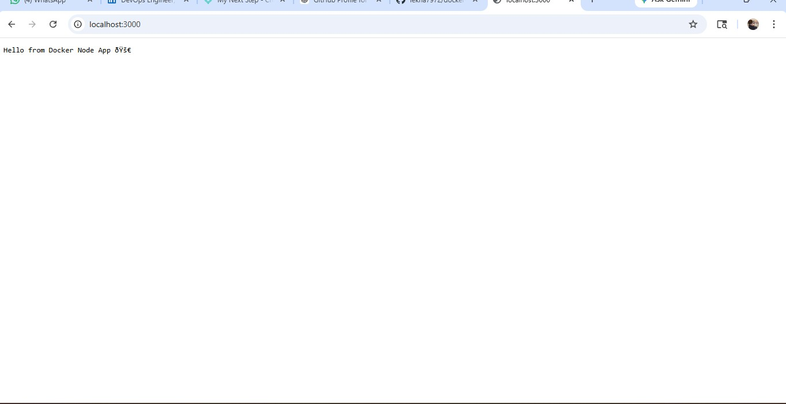
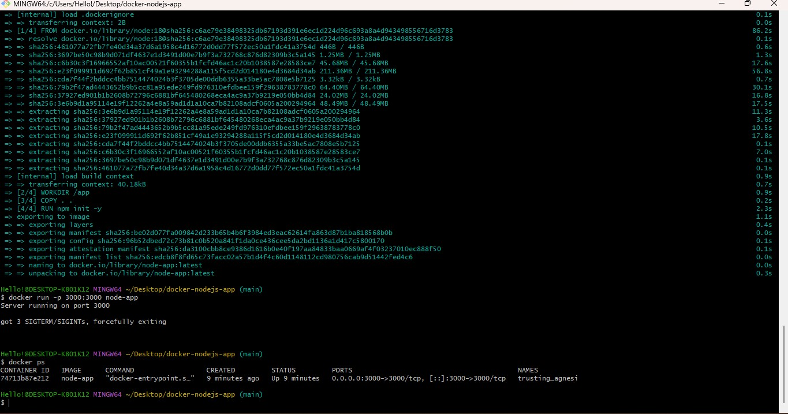
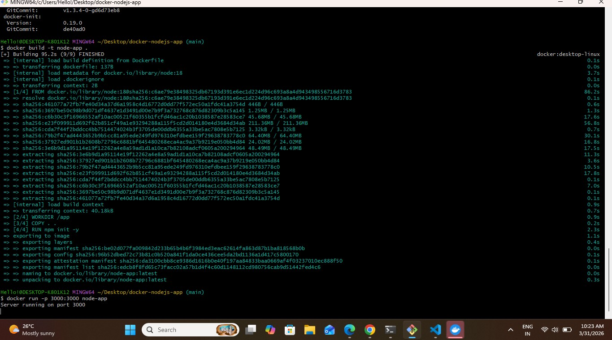

# Docker Node.js App 🚀

Dockerized Node.js application demonstrating containerization and deployment using Docker.

---

## 🛠 Tech Stack
- Node.js
- Docker

---

##🚀 How to Run

```bash
docker build -t node-app .
docker run -p 3000:3000 node-app

---

## 📸 Screenshots

### Application Output


### Docker Containers


### Running Container

